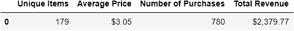
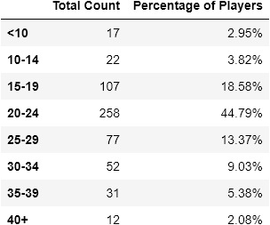
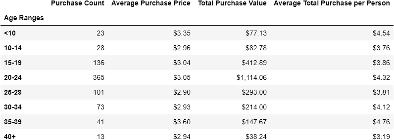

# Video Game Purchasing

## Background
Like many others in its genre, this game is free-to-play, but players are encouraged to purchase optional items that enhance their playing experience. Generate a report that breaks down the game's purchasing data into meaningful insights.

## Methods
1. Find total Number of Players by using `.count()[0]` function
2. Purchasing Analysis (Total)
   * Number of Unique Items
   * Average Purchase Price
   * Total Number of Purchases
   * Total Revenue
3. Gender Demographics
   * Percentage and Count of Male Players
   * Percentage and Count of Female Players
   * Percentage and Count of Other / Non-Disclosed
4. Purchasing Analysis (Gender)
   * The below each broken by gender
   * Purchase Count
   * Average Purchase Price
   * Total Purchase Value
   * Average Purchase Total per Person by Gender
5. Analyze the age Demographics by breaking the following into bins (i.e. <10, 10-14, 15-19, etc.)
   * Purchase Count
   * Average Purchase Price
   * Total Purchase Value
   * Average Purchase Total per Person by Age Group
6. Identify the top spenders in the game by total purchase value, then list (in a table):
   * SN
   * Purchase Count
   * Average Purchase Price
   * Total Purchase Value
7. Identify the five most popular items by purchase count, then list (in a table): 
   * Item ID
   * Item Name
   * Purchase Count
   * Item Price
   * Total Purchase Value
9. Identify the five most profitable items by total purchase value, then list (in a table):
   * Item ID
   * Item Name
   * Purchase Count
   * Item Price
   * Total Purchase Value

## Results
### Number of Players

### Purchase Summary

### Gender Demographics

### Purchasing Analysis (Gender)

### Age Demographics
  

### Purchasing Analysis (Age)

### Top Spenders

### Most Popular Items

### Most Profitable Items

>>>>>>> f51b6296c50df48eaf8f38e40f7c0664e626432a

## Observations and Findings

