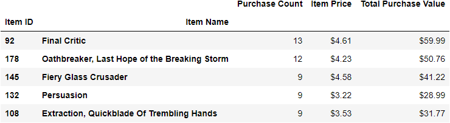

Background: Like many others in its genre, the game is free-to-play, but players are encouraged to purchase optional items that enhance their playing experience.

Task: 
1. Analyze the in-app purchase data for a recently launched fantasy game. 
2. Generate a report to include the following: 
	* Player Count
	* Purchasing Analysis (Total)
	* Gender Demographics
	* Purchasing Analysis (Gender)
	* Age Demographics
	* Top Spenders
	* Most Popular Items
	* Most Profitable Items
	* Top Spenders
	* Most Popular Items
	* Most Profitable Items

### Player Count

### Purchasing Analysis (Total)

### Gender Demographics

### Purchasing Analysis (Gender)

### Purchasing Analysis (Age)

### Top Spenders

### Most Popular Items

### Most Profitable Items

